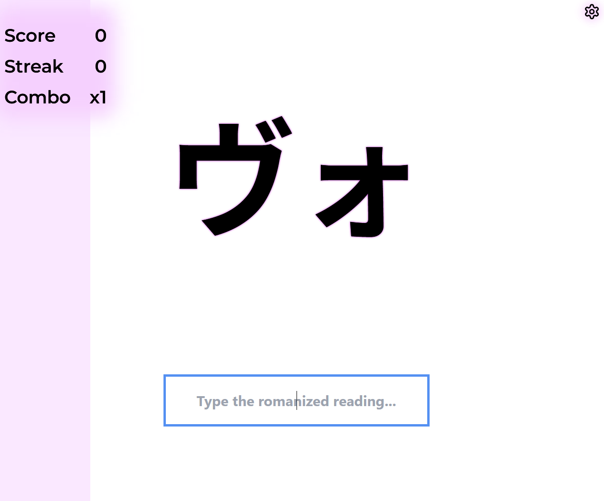
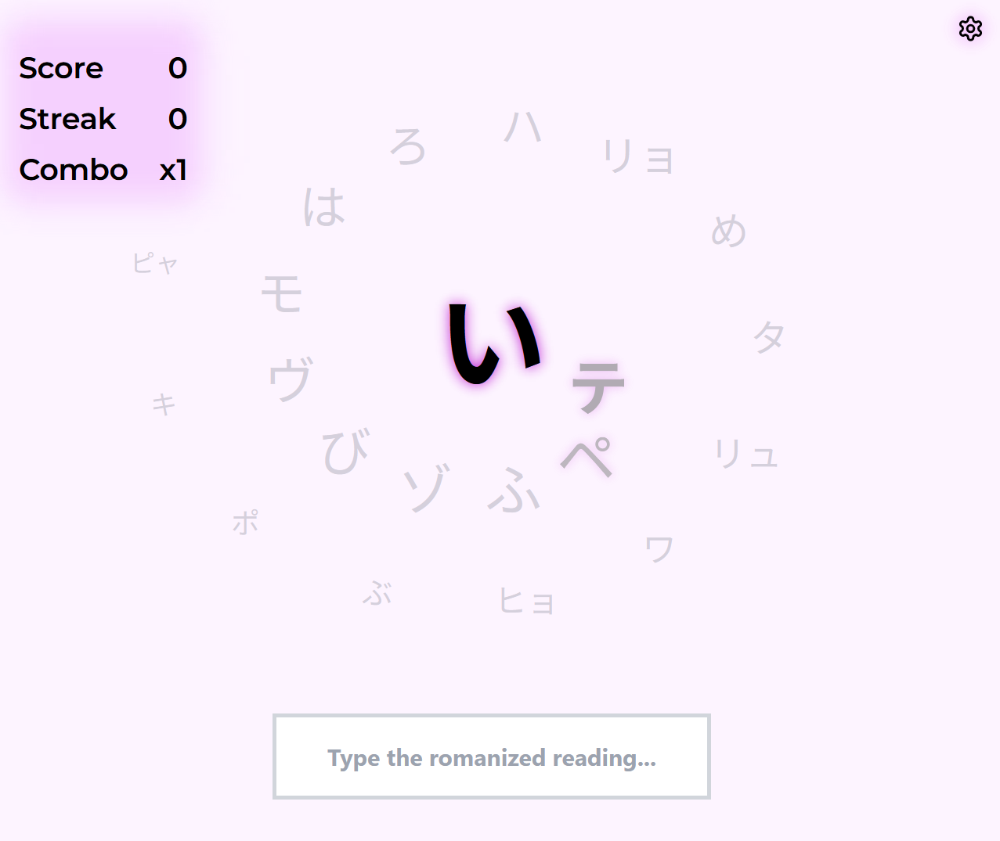

# rote-rush

Rote memory game to memorise script, e.g. learn Japanese kana

Play here: https://emily-li.github.io/rote-rush




## Dependencies

1. Install pnpm https://pnpm.io/installation
2. Set pnpm in your path, e.g. in your ~/.bashrc file add

```bash
pnpm="/c/Users/<username>/AppData/Local/pnpm"
export PATH="$PATH:$pnpm"
```

3. Install node `pnpm env -g add 22` and `pnpm env -g use 22`

## Build

1. `pnpm install`
2. `pnpm dev`

## Tests

- Run tests: `pnpm test`
- Watch tests: `pnpm vitest`
- Run tests with coverage: `pnpm test:coverage`
- Single test: `pnpm test:coverage useTimer`
